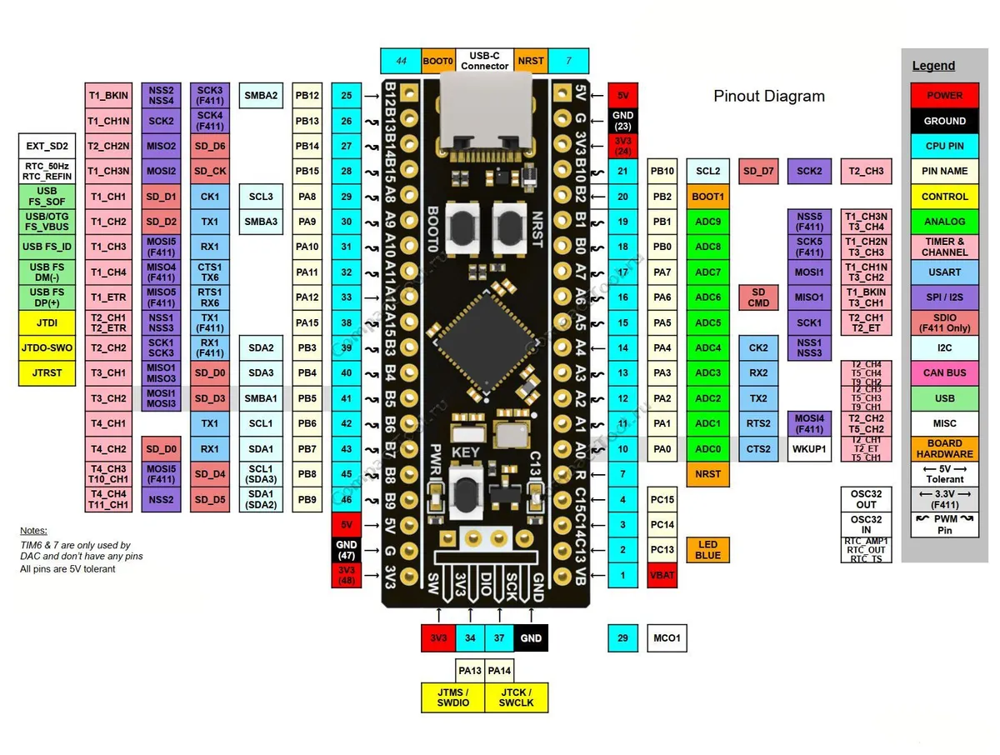

# Отладочная плата Black Pill на микроконтроллере STMicroelectronics STM32F401CCU6

**Black Pill** - модуль разработки на базе микроконтроллера STM32F401CСU6,
основанном на высокопроизводительном 32-битном RISC-ядре ARM® Cortex®-M4,
работающем на частоте до 84 МГц. Ядро Cortex®-M4 оснащено модулем с плавающей
запятой (FPU) одинарной точности, который поддерживает все инструкции и типы
данных ARM по обработке данных с одинарной точностью. Он также реализует полный
набор инструкций DSP и блок защиты памяти (MPU), который повышает безопасность
приложений.

Микроконтроллер оснащен одним 12-битным АЦП, маломощным RTC, шестью 16-битными
таймерами общего назначения, включая один таймер ШИМ для управления двигателем,
двумя 32-битными таймерами общего назначения. Они также оснащены стандартными
и расширенными интерфейсами связи. 

Доступные ресурсы:
- Частота: до 84 МГц
- Количество выводов: 36 без учета выводов питания
- ПЗУ: 256 кБ (возможность расширения при помощи микросхемы SPI-Flash W25QXX)
- ОЗУ: 64 кБ
- Таймеры: 11 таймеров + RTC
- Интерфейсы подключения:
- 3x USART до 12.5 Мб/с
- 5x SPI до 50 Мб/с
- 3x I2C до 1 Мб/с
- 3x SDIO до 1 Мб/с
- 1x USB 2.0 OTG
- 2x I2S до 32 бит/192 кГц дуплексный
- 3x I2S до 32 бит/192 кГц односторонний
- АЦП: 12-бит 2.4 MSPS
- Тип разъема: USB Type-C

